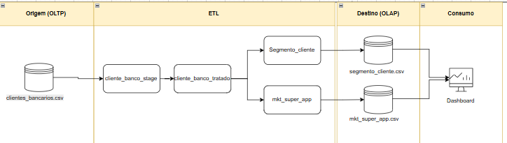

# 📊 Análise de Clientes Bancários

## 📋 Índice

- [Sobre o Projeto](#sobre-o-projeto)
- [Funcionalidades](#funcionalidades)
- [Tecnologias Utilizadas](#tecnologias-utilizadas)
- [Requisitos](#requisitos)
- [Instalação](#instalação)
- [Uso](#uso)
- [Estrutura dos Dados](#estrutura-dos-dados)
- [Análises Disponíveis](#análises-disponíveis)
- [Resultados Esperados](#resultados-esperados)

## 🎯 Sobre o Projeto

Este projeto realiza uma análise abrangente de dados de clientes bancários, fornecendo insights valiosos sobre segmentação, satisfação, engajamento digital e comportamento de churn. Desenvolvido em Python com Jupyter Notebook, o projeto oferece visualizações interativas e métricas acionáveis para tomada de decisão estratégica.

### Principais Objetivos

- 🔍 **Segmentação de Clientes**: Identificar perfis e clusters de comportamento
- 📱 **Engajamento Digital**: Avaliar adoção de canais digitais

## Desenho da Pipeline de dados ETL



## ✨ Funcionalidades

### 1. Extração e Preparação de Dados
- Carregamento de dados de arquivos CSV
- Limpeza e validação de tipos de dados
- Tratamento de valores ausentes e inconsistentes
- Padronização de campos categóricos

### 2. Segmentação de Clientes
- **Análise por Faixa Etária**: Perfil demográfico dos clientes
- **Segmentação Financeira**: Classificação por capacidade financeira (Básico, Intermediário, Premium)
- **Clustering**: Identificação de grupos similares usando K-Means
- **Perfil por Tipo de Conta**: Características por produto bancário

### 3. Engajamento Digital
- Taxa de adoção do app mobile por geração
- Correlação entre uso do app e atividade transacional
- Identificação de oportunidades de migração digital
- Análise por tipo de conta

## 🛠 Tecnologias Utilizadas

- **Python 3.8+**
- **Pandas**: Manipulação e análise de dados
- **NumPy**: Computação numérica
- **Matplotlib**: Visualização de dados
- **Seaborn**: Visualizações estatísticas avançadas
- **Scikit-learn**: Machine Learning (K-Means clustering)
- **SciPy**: Análises estatísticas
- **Jupyter Notebook**: Ambiente de desenvolvimento interativo

## 📦 Requisitos

### Dependências Principais

```txt
pandas>=1.3.0
numpy>=1.21.0
matplotlib>=3.4.0
seaborn>=0.11.0
scikit-learn>=0.24.0
scipy>=1.7.0
jupyter>=1.0.0
```

## 🚀 Instalação

### 1. Clone o Repositório

```bash
git clone https://github.com/seu-usuario/analise-clientes-bancarios.git
cd analise-clientes-bancarios
```

### 2. Crie um Ambiente Virtual (Recomendado)

```bash
# Windows
python -m venv venv
venv\Scripts\activate

# Linux/Mac
python3 -m venv venv
source venv/bin/activate
```

### 3. Instale as Dependências

```bash
pip install -r requirements.txt
```

### 4. Prepare os Dados

Coloque o arquivo `clientes_bancarios.csv` na raiz do projeto.

## 💻 Uso

### Executar o Notebook

```bash
jupyter notebook
```

Abra o arquivo principal e execute as células sequencialmente:

1. **Etapa 1**: Extração dos Dados
2. **Etapa 2**: Preparação e Tratamento
3. **Etapa 3**: Segmentação de Clientes
4. **Etapa 4**: Visualização dos Segmentos
5. **Etapa 5**: Análise de Satisfação
6. **Etapa 6**: Engajamento Digital

### Exemplo de Uso Rápido

```python
import pandas as pd

# Carregar dados
df_clientes = pd.read_csv('clientes_bancarios.csv', encoding='utf-8')

# Preparar dados
df_tratado = converter_tipos_dados(df_clientes)
df_validado = validar_valores(df_tratado)

# Executar análises
resultados_segmentacao, df_segmentado = analisar_segmentos_clientes(df_validado)
resultados_satisfacao, df_analisado = analisar_satisfacao_clientes(df_validado)
resultados_engajamento, df_engajamento = analisar_engajamento_digital(df_validado)
```

## 📊 Estrutura dos Dados

### Arquivo de Entrada: `clientes_bancarios.csv`

| Campo | Tipo | Descrição | Valores Válidos |
|-------|------|-----------|-----------------|
| `idade` | int | Idade do cliente | 18-100 |
| `genero` | string | Gênero do cliente | M/F |
| `renda_mensal` | decimal(16,2) | Renda mensal em R$ | >= 0 |
| `saldo_conta` | decimal(16,2) | Saldo atual da conta | >= 0 |
| `score_credito` | int | Score de crédito | 300-850 |
| `possui_cartao_credito` | string | Possui cartão de crédito | Sim/Não |
| `tipo_conta` | string | Tipo de conta bancária | Corrente/Poupança/Salário |
| `usa_app_mobile` | string | Usa aplicativo mobile | Sim/Não |
| `participa_programa_fidelidade` | string | Participa do programa | Sim/Não |
| `satisfacao_geral` | int | Nível de satisfação | 0-10 |
| `numero_transacoes_mes` | int | Transações mensais | >= 0 |
| `media_valor_transacao` | decimal(16,2) | Valor médio | >= 0 |
| `atrasos_pagamento` | int | Quantidade de atrasos | >= 0 |
| `churn` | string | Cliente evadiu | Sim/Não |

## 📈 Análises Disponíveis

### 1. Segmentação de Clientes

#### Outputs:
- DataFrame com clusters identificados
- Perfil por faixa etária (18-25, 26-35, 36-50, 51-65, 65+)
- Segmentação financeira (Básico, Intermediário, Premium)
- 3 clusters comportamentais via K-Means

#### Visualizações:
- Distribuição por faixa etária
- Renda média por segmento
- Scatter plot dos clusters
- Saldo médio por tipo de conta

### 2. Análise de Satisfação

#### Métricas Calculadas:
- **NPS por tipo de conta**
- **NPS por uso do app**
- Correlações com satisfação
- Média e desvio padrão por segmento

#### Visualizações:
- Drivers de satisfação (barras de correlação)
- NPS por produto
- Satisfação vs uso do app
- Impacto do programa de fidelidade

### 3. Engajamento Digital

#### Métricas Calculadas:
- Taxa de adoção por geração (%)
- Correlação app × transações (point-biserial)
- Média de transações por uso do app
- Oportunidades de migração digital

#### Visualizações:
- Adoção por faixa etária
- Transações por uso do app
- Adoção por tipo de conta
- Clientes candidatos à migração

## 📋 Resultados Esperados

### Segmentação
```
Faixa Etária  | Renda Média | Score Médio | Saldo Médio
18-25         | R$ 3.500    | 650         | R$ 5.000
26-35         | R$ 5.200    | 680         | R$ 12.000
36-50         | R$ 7.800    | 720         | R$ 25.000
51-65         | R$ 6.500    | 710         | R$ 35.000
65+           | R$ 4.200    | 690         | R$ 28.000
```

### NPS por Produto
```
Tipo de Conta  | NPS
Corrente       | 45.2
Poupança       | 38.7
Salário        | 52.3
```

### Engajamento Digital
```
Faixa Etária  | Taxa Adoção App
18-25         | 78%
26-35         | 72%
36-50         | 58%
51-65         | 35%
65+           | 18%
```

---